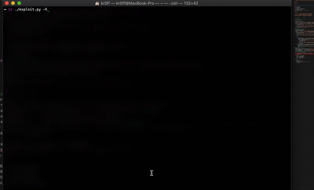

# SeoPanel-4.6.0-RCE
SeoPanel 4.6.0 is vulnerable to authenticated remote code execute

For testing, the vulnerable version can be downloaded from here: https://www.seopanel.org/spdownload/4.6.0.

The script is capable of self-cleaning after the webshell is uploaded. Upon ctrl+c a request will be sent to remove the webshell from the server.

## Installing prerequisites
```shell
pip install -r requirements.txt
```

## Example:

